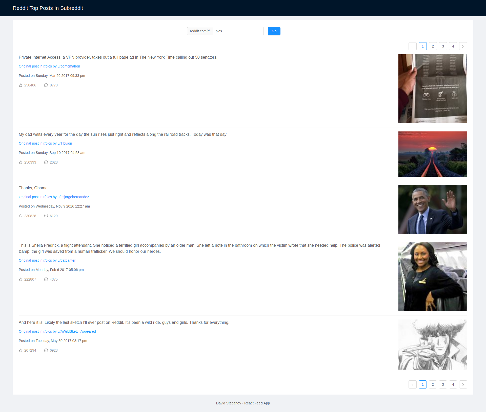
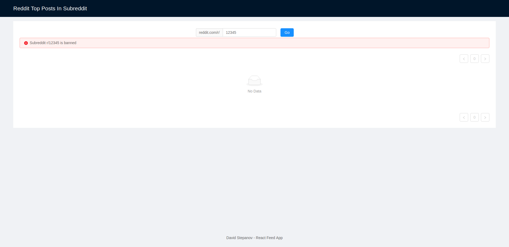

# Reddit Feed Frontend

React frontend for a simple Reddit feed app

[Deployed to heroku](https://reddit-feed-frontend.herokuapp.com/)

## Getting Started

These instructions will get you a copy of the project up and running on your local machine for development and testing purposes. See deployment for notes on how to deploy the project on a live system.

### Prerequisites

Node, npm and preferably yarn should be installed.
Clone this repository into your prefered location.

```
$ git clone https://github.com/divadvo/Reddit-Feed-Frontend
$ cd Reddit-Feed-Frontend
```

### Installing

First install the dependencies using `yarn`

```
$ yarn
```

### Run locally

```
$ yarn start
```

Go to `localhost:3000` to see the app

## Running the tests

The tests will test React app. Tests are in `src/App.test.js`. In that file you can change `QUICK_TEST` to slow-down the testing and see what exactly is going on.

The tests open a browser using `puppeteer`, inputs test cases automatically and checks that the data or errors are displayed.
(Note that depending on your OS you might have to check that puppeteer can actually start the Chrome instance)

The local backend server has to be running to test the frontend. Run the backend with `yarn start`.
The local frontend dev server has to be running too, so in another terminal run:

```
$ yarn start
```

Then in a new terminal run the following command to actually test the frontend:

```
$ yarn test
```

## Deployment

Create a new app on Heroku. Use this buildpack for React: `https://github.com/mars/create-react-app-buildpack.git`

Optional: create app using Heroku CLI: `$ heroku create`.
Or connect to existing app: `$ heroku git:remote -a reddit-feed-backend`

```
$ heroku buildpacks:set https://github.com/mars/create-react-app-buildpack.git
$ git push heroku master
```

Deploy backend: [Backend Repository](https://github.com/divadvo/Reddit-Feed-Backend)

Change `BACKEND_URL_PRODUCTION` in `src/Dashboard/index.js` to point to the backend domain.

## Built With

- Create-react-app
- Ant Design - UI framework
- craco - To make Ant Design work with create-react-app
- Moment.js - To format timestamp into readable string
- Axios - HTTP client for making API requests
- Jest - For testing
- puppeteer - End-to-end testing

## How it works

- The UI is build with Ant Design React components.
- In the `Dashboard` component, I use Ant design inbuilt form validation to check the subreddit with a regex and display an error. The user cannot search, unless the subreddit name is in correct format. Even if the request is made, the backend checks if the name is correct and would return an error anyway
- After the users click on `Go`, a spinner is shown to indicate progress made
- A GET request is made with axios. The result data is stored in the component state and passed to the `Feed` component as a prop.
- In case my API endpoint return an error, I display this error and the related message in an alert box.
- The `Feed` component just displays the data, passed as prop.
- App is responsive

## Screenshots

r/pics subreddit:



Wrong input:


Banned subreddit:



Responsive:


## Author

- **David Stepanov** - [divadvo](https://github.com/divadvo)
